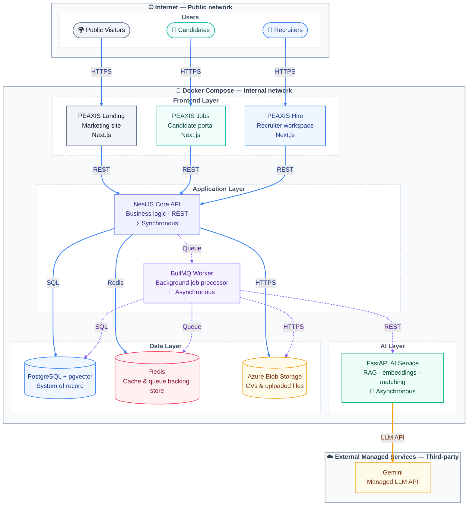

# PEAXIS Deployment Architecture

Source diagram for the platform's deployment/container architecture. This
replaces the earlier React Flow prototype — this file is the single source
of truth going forward.

- **Edit here**: this is plain Mermaid syntax, no build step required.
- **Preview in VS Code**: open this file and run "Markdown: Open Preview"
  (or install the "Markdown Preview Mermaid Support" extension if the block
  doesn't render).
- **Redesign in Figma**: paste the code block into the
  [Mermaid Live Editor](https://mermaid.live), export as SVG, then drag the
  SVG into a Figma file — it imports as fully editable vector layers/groups.
- **Legend**: solid blue = synchronous (HTTP/SQL/Redis calls), dashed violet
  = asynchronous (queue-driven), thick amber = external managed API call.
  No frontend app talks to Gemini directly — all AI work is routed through
  Core API → BullMQ Worker → FastAPI.

Rendered preview (regenerate after editing the source below, see
"Regenerating the preview image" at the bottom):





## Regenerating the preview image

The `.svg`/`.png` files next to this doc are pre-rendered snapshots for quick
viewing — they are NOT the source of truth, the Mermaid code block above is.
After editing the diagram, regenerate them with
[`@mermaid-js/mermaid-cli`](https://github.com/mermaid-js/mermaid-cli):

```bash
# 1. extract the ```mermaid block above into a standalone .mmd file, then:
npx @mermaid-js/mermaid-cli -i architecture-deployment.mmd -o architecture-deployment.svg -b white
npx @mermaid-js/mermaid-cli -i architecture-deployment.mmd -o architecture-deployment.png -b white --scale 3
```

